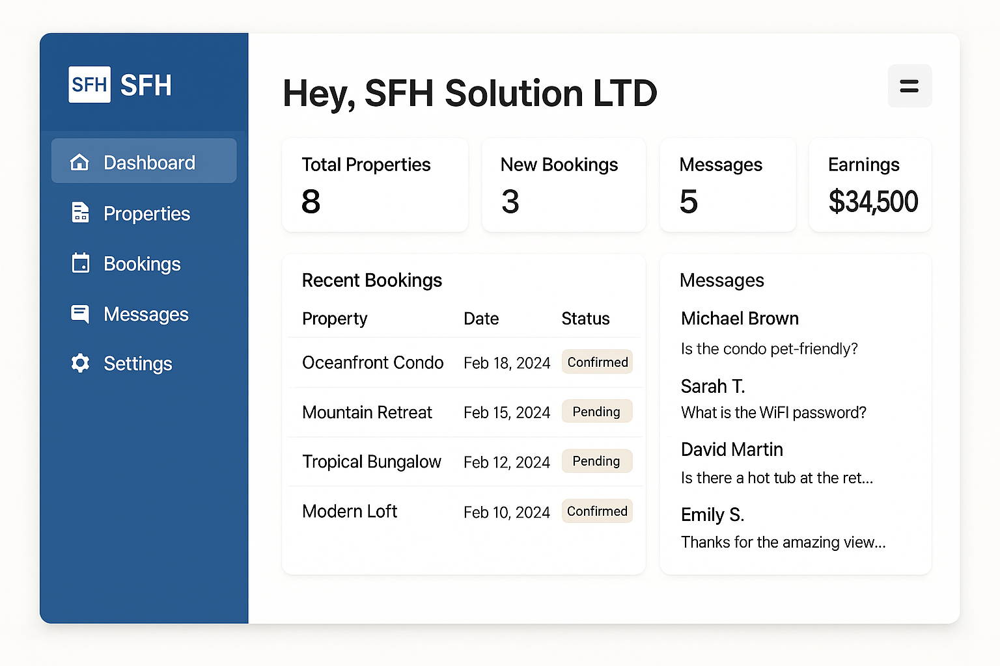
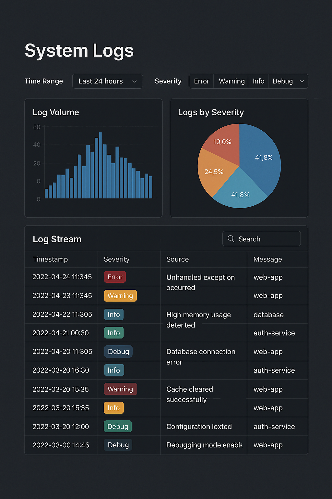

# 🐉 Kali-Themed Portfolio Website

A multipage personal portfolio built with **HTML5, CSS3, and JavaScript**, styled after the look and feel of **Kali Linux**.  
The site uses a **grid background**, **neon hacker-style effects**, and **terminal-inspired animations** to present information in a unique and engaging way.

---

## 🌍 Live Demo
[Live Website Link](#) (to be updated after deployment on GitHub Pages / Netlify / Vercel)

---

## 📂 Project Structure

portfolio-kali/
│── index.html # Home page with terminal whoami effect
│── about.html # About page with profile info
│── projects.html # Showcase of projects in glowing cards with screenshots
│── skills.html # Skills page with terminal cat skills.txt effect
│── contact.html # Contact page with terminal cat contact.txt + form
│
│── css/
│ └── style.css # Grid background, terminal theme, neon styling
│
│── js/
│ └── script.js # Terminal typing effects, form validation, interactivity
│
│── images/
│ ├── profile.jpg # Profile picture
│ ├── project1.png # Roofa.co.ke screenshot
│ ├── project2.png # SFH Solution Ltd branding
│ ├── project3.png # Cybersecurity technical assessments
│ ├── project4.png # Hackathon project
│ ├── project5.png # Security dashboard
│ └── logo.png # Optional logo/icon
│
└── README.md

---

## ✨ Features
- **Grid background** with parallax effect
- **Terminal-inspired intro** (`whoami`, `echo`)
- **Project cards** with neon hover glow + image previews
- **Skills list** typed out as `cat skills.txt`
- **Contact page** with `cat contact.txt` output + interactive form
- **Form validation** with terminal-style success/error messages

---

## 🛠️ Tech Stack
- **HTML5** – semantic structure
- **CSS3** – grid background, responsive layout, neon styling
- **JavaScript** – typing animations, interactivity, validation
- **Deployment Options** – GitHub Pages, Netlify, or Vercel

---

## 📸 Screenshots

### 🏠 Home Page

### 👤 About Page

### 🛠 Projects Page

### ⚙️ Skills Page

### 📩 Contact Page

---

## 👨‍💻 Author
**Kelvin Wanyama**  
Cybersecurity Analyst | Web Developer | Tech Explorer  

- GitHub: [Leitearts](https://github.com/Leitearts)  
- LinkedIn: [Kelvin Wanyama](https://linkedin.com/in/kelvin-wanyama)  
- Email: [kelvinwanyama25@gmail.com](mailto:kelvinwanyama25@gmail.com) 
